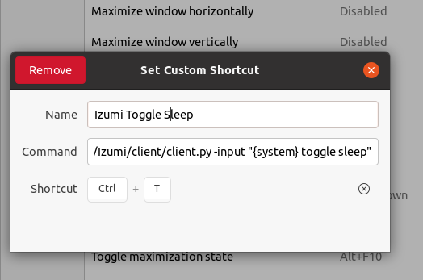

# Izumi
**Izumi** is a cross-platform python programm that first converts human voice to text and then sends its through a series of modules to provide various functionalities. This can be used, for example, to dictate texts, to execute own voice commands or learn a foreign language. A possible processing chain could for example first translate the text to Spanish, then insert the translation at the current cursor position. And in a last step save the translation in a file.
Izumi also supports voice commands e.g. saying *Izumi shutdown* will shutdown the program.
Most of the complex modules use preexisting machine learning api's over the internet.

Key Features:

- a pipline of different modules (the output of a module is the input of the next one)
- easy to add new functionality with a module
- support of own voice commands instead of a GUI with a new module
- remote controllable via e.g. hot keys

I started to develop Izumi because there was no free good voice dictation out there, which could easily be extended with new features.

## Table of Contents
1. [ How to Install ](#install)
2. [ Usage](#usage)
3. [ Profile file](#profile)
4. [ Modules](#modules)
5. [ Voice Commands](#voice)
6. [ Remote Control and Hot Keys](#remote)
7. [ Develop your own Module](#dev)
8. [ License](#license)
9. [ Contact and Donate](#contact)

### How to Install <a name="install"></a>
Most missing dependencies can be installed with *pipenv install* in the project folder.
The following list shows which modules of Izumi need which dependencies.

Main Module:

 - [SpeechRecognition](https://pypi.org/project/SpeechRecognition/)
 - (recommended) get own Google Speech Recognition API key
 - PyAudio 0.2.11+ is needed to access the micro input
 - pygame for playing sounds


DeeplTranslatorModule:

 - selenium-wire for the deepl translator module
 - a working chromedriver for selenium/selenium-wire

TextToSpeechModule:

 - gTTS to convert speech to text
 - pydub for converting audio formats
 - ffmpeg for converting audio formats

DictationModule:

- pyautogui
- pyperclip for Linux you need additionally xclip or xsel


JapaneseCharTransformerModule

- pykakasi to transform kanji to e.g. hiragana

**Please contact the [ developer](#contact), if there are missing steps, which are not listed here!**

For Ubuntu 20.4
sudo apt install xclip
sudo apt install ffmpeg
sudo apt-get install libasound-dev portaudio19-dev libportaudio2 libportaudiocpp0


## Usage <a name="usage"></a>
The following command starts Izumi:

*pipenv run python main.py  -key "YOUR_OWN_GOOGLE_SPEECH_RECOGCITION_KEY" -profile "profiles/example.json"*


For simple test purposes the key parameter can also be omitted. In this case a default key is used. All other parameters are defined in the profile file provided.

The optional argument `--server` allows it to send commands over a tcp socket to izumi, which allows for example control it via hot keys see [ Remote Control and Hot Keys](#remote).
### The Profile File <a name="profile"></a>
Profile files are written in the [HJSON](https://hjson.github.io/) format.
For examples see in *example_profiles* folder.


| Section 	| Parameter 	| Type 	| Description 	| Values 	|
|--------	|-----------	|------	|-------------	|--------	|
|  main-module      	|  system-name         	| string     	| used for diffenciate voice commands from normal voice input             	|  string      	|
|main module|start-sleeping|boolean|defines if Izumi is in the sleeping mode after the starting | true or false
|   main-module     	|   system-language        	|  string    	|  language of the voice commands           	| ignored       	|
| module entry       	|      name     	|  a module class name    	|  [See usable modules (src/modules/__init__.py)](src/modules/__init__.py)           	|        	|
|module entry|activated| boolean| the activiation state| true or false |
|module entry|id|string| gives the module a name for referencing e.g. process (\{*id*_in\}) and output as (\{*id*_out\}) | true or false |
|module entry|settings| json object| indiviual settings for each module |
|speech-to-text|api-key|string| google api key|


### Voice Commands <a name="voice"></a>
All voice commands follow the pattern system-name trigger parameter. The default system-name is Izumi, but it can be changed in the  profile. If a sentence starts with the system name, then a action is triggered instead of sending the input through the pipeline. If the system-name is missing the input is send through the normal pipeline.
Not all actions need a parameter.
The voice commands of the main module which are always active are listed below.

| Trigger	| Description 	|
|--------	|-----------	|
|shutdown| ends the program|
|go to sleep| Izumi go to sleep until waked up (input is ignored)|
|toggle sleep| switch between sleep and active|
|wake up |set Izumi to active|
|load profile PROFILE_FILE|load a profile file (lower case) in the profile folder. Adding .json to the name and replacing spaces with underscores. For example saying *Izumi load profile English dictation* will try to load the file *profiles/english_dictation.json*|

Each module can define his own voice commands e.g. the TextToSpeechModule defines the replay function. But this function can only be used, if TextToSpeechModule is used.

### Modules <a name="modules"></a>
**PrintModule:**

Prints the input to the console.

Parameters:

- format (optional): a output format after the [Python string format](https://www.w3schools.com/python/ref_string_format.asp ). For example *"{translator_in} => {translator_out}\n"* will print the input and output for the module with the id translator in one line.
If omitted the input of the module is used as the output.

**DeeplTranslatorModule**

Translates the input to another language by using [www.deepl.com](https://www.deepl.com/translator).


See [lang_codes.txt](src/modules/deepl_translator/lang_codes.txt) for the input and output language codes. For example "de" is the input code for german.

Parameters:

- **input-language:** the input language code. Also accepts auto for language detection.
- **output-language:** the output language code
- **timeout (number):** timeout in seconds for calling the web api

**DictationModule**

Inserts the module process at the current cursor position. Ctrl+z can be used to revert the change.

Parameters:

- format (optional): see PrintModule.

**FileWriterModule**

Writes the input to a file.

Parameters:

- format (optional): see PrintModule.
- file: specifies a file name

**JapaneseCharTransformerModule**

Transform kanji to for e.g. hiragana. Introduces by processing the input the variables hira, kana, romji and orig, which can be used from now on in the format e.g. "{hira}"

Parameters:

- format (optional): see PrintModule.

**OfflineTranslatorModule**
TODO write docs

**PunctuationMarksReplacer**
Replaces words with punctuation marks e.g. *Are you busy question mark* is transformed to *Are you busy?*

The mapping is defined in
[replacement_table.py](src/modules/punctuation_marks_replacer/replacement_table.py).

Parameters:

- language: the used language only "de-DE" is supported at the moment.

**TextToSpeechModule**

Converts the input to audio with a certain pronunciation (language parameter) and plays its back by using [https://gtts.readthedocs.io/en/latest/.](https://gtts.readthedocs.io/en/latest/).

Voice commands defined by this module:


| Action 	| Description 	|
|--------	|-----------	|
|replay| replays the last played sound|

Parameters:

- slow (boolean): reduces if set the play back speed
- language: an IETF language tag
## Remote Control <a name="remote"></a>
By starting Izumi with the `--server` option allows it to send input to Izumi over a tcp socket (default port 47193). Which allows it Izumi to accept voice commands remotely. This can be used to trigger with hot keys the same functions in Izumi. For example by binding `<ctrl>+<T>` in the operating system settings to the command: 
 
`python3 /home/patrick/projects/Izumi/client/client.py -input "{system} toggle sleep"`


This will activate and deactivate Izumi by pressing the hot key. The system variable ({system}) is automatically replaced with the appropriate system name (here with Izumi).  
The client.py sends just the argument to Izumis default socket. And then closes the connection. 



## Develop your own module <a name="dev"></a>
The following code shows the *FooModule*, which is a copy of the *PrintModule* and extented with an own voice command. Which prints "Hello World!" to the console and is activated by saying *Izumi hello*.

The process function takes a string as input and produces the output for the next module. In this case the string is forwarded unchanged. By returning *None* the pipeline aborts earlier after the process function. This is useful e.g. in a timeout.

The dictionary *settings* contains all parameters are definend in the setting section in the profile file for each module.  

All voice commands are registered in the *register_voice_commands* function. The first parameter is always the id of the module instance. The second is a single string or a list of strings e.g. ["hello","greeting","good morning"] which will trigger a function (third parameter). By saying "Izumi hello I need you" the call _hello("Izumi","hello","I need you") is automatically executed.

The voice command function should return an *ParseResult*. The most common are:

- COMMAND_ACCEPTED: in success
- COMMAND_ACCEPTED_SILENT: in success and if you need to play a sound
- ARGUMENT_ERROR: the argument is not accepted by the function

In this particular case we ignore the argument and accept all calls by returning *COMMAND_ACCEPTED*. For more examples see in module folder.

To make the module usable copy it to a subfolder in src/modules and set an entry in the src/modules/\_\_init\_\_.py file.

```python
   class FooModule(ModuleInterface):
        def process(self, text: str) -> str:
            if "format" in self.settings:
                fmt = PartialFormatter()
                text = fmt.format(self.settings["format"], **self.module_variables)
            print(text)
            return text

        def _hello(self, system_name: str, trigger: str, argument: str) -> ParseResult:
            print("Hello World!")
            return ParseResult.COMMAND_ACCEPTED

        def register_voice_commands(self, sentence_parser : SentenceParser):
            sentence_parser.register_action(id(self), "hello", self._hello)
```

### License <a name="license"></a>
Izumi is published under the *GNU Affero General Public License*.
## Contact <a name="contact"></a>
Created by Patrick Mispelhorn (patrick.mispelhorn@web.de) - feel free to contact me!
## 

Support the development of Izumi:
[Izumi's Patreon Page](https://www.patreon.com/user?u=59017530)
